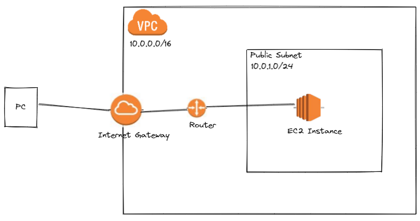

## Architecture




## Commands
1. cd ~/.ssh
   ssh-keygen -> use ```mmgkey``` as a name
2. terraform plan
3. terraform apply
4. ```ssh -i ~/.ssh/mmgkey ubuntu@<public-IP-address-of-the-EC2-instance>```
5. terraform plan -destroy
6. terraform apply -destroy

### Resources:

1. Terraform Course - Automate your AWS cloud infrastructure - https://www.youtube.com/watch?v=SLB_c_ayRMo
2. Learn Terraform (and AWS) by Building a Dev Environment – Full Course for Beginners - https://www.youtube.com/watch?v=iRaai1IBlB0
3. https://github.com/github/gitignore/blob/main/Terraform.gitignore