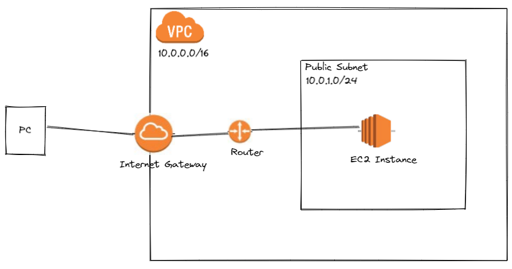

## Architecture

## Commands
- terraform plan

- terraform apply

- terraform plan -destroy

- terraform apply -destroy

### Resources:

1. Terraform Course - Automate your AWS cloud infrastructure - https://www.youtube.com/watch?v=SLB_c_ayRMo
2. Learn Terraform (and AWS) by Building a Dev Environment – Full Course for Beginners - https://www.youtube.com/watch?v=iRaai1IBlB0
3. https://github.com/github/gitignore/blob/main/Terraform.gitignore